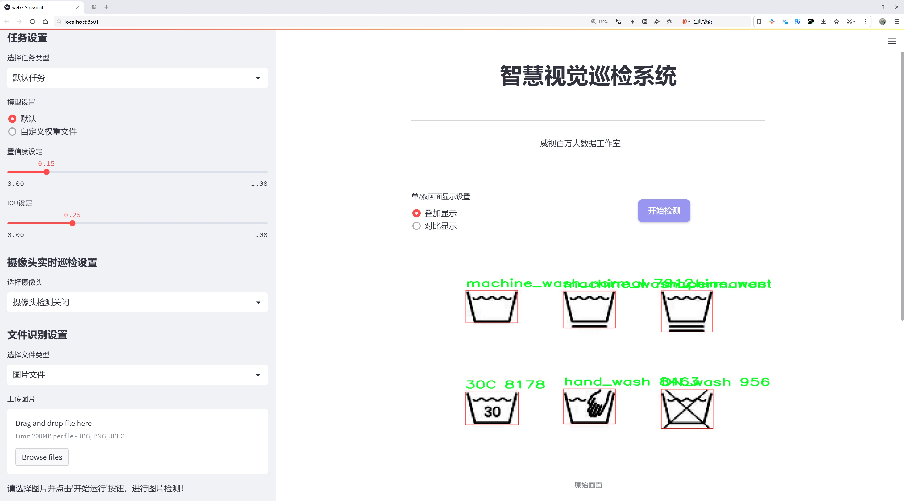
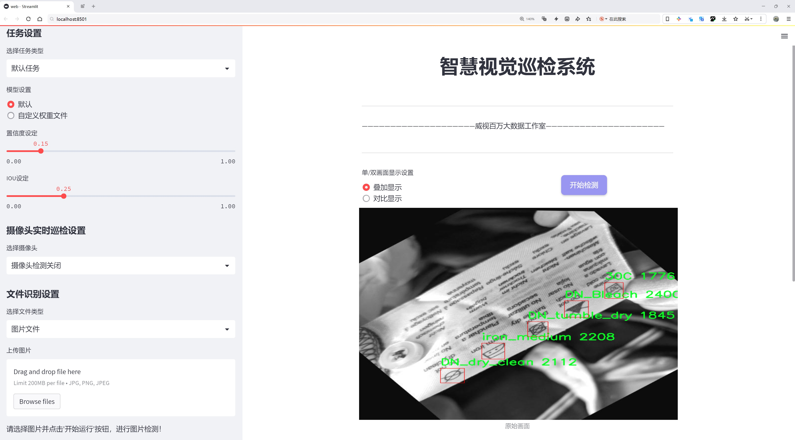
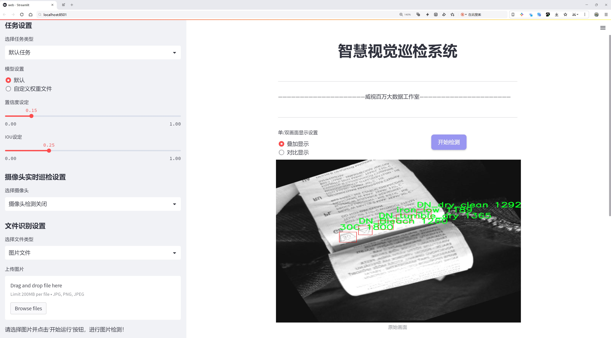
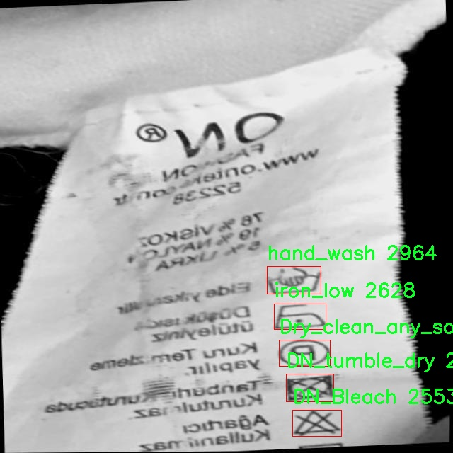
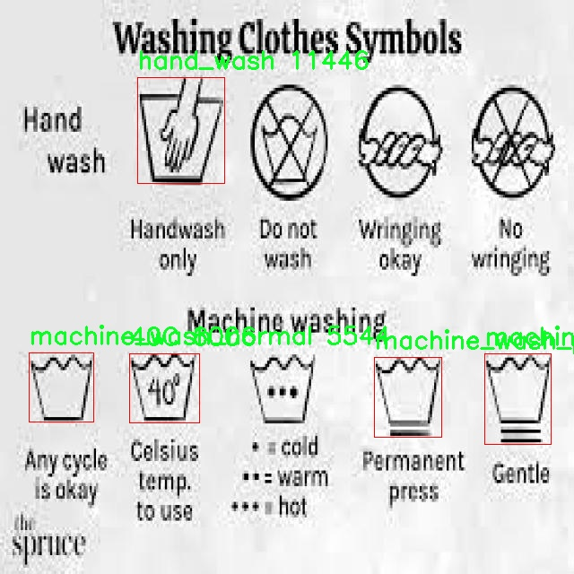
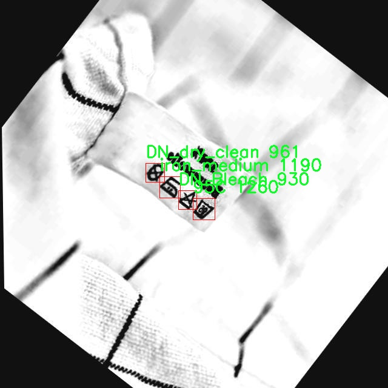
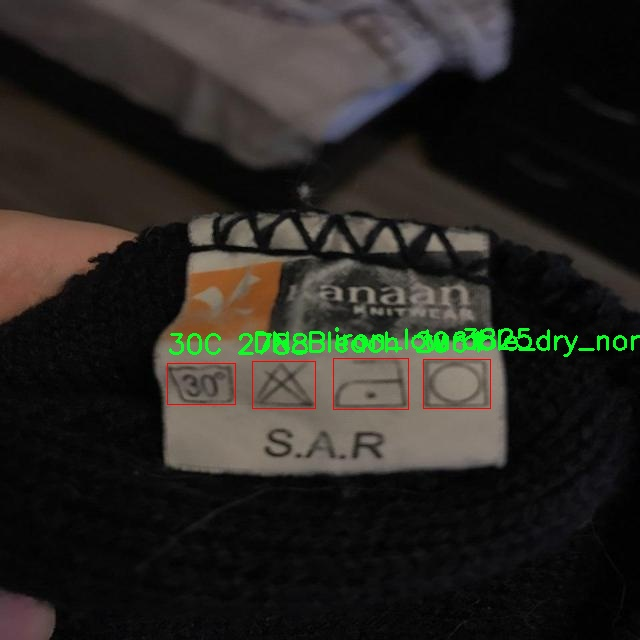
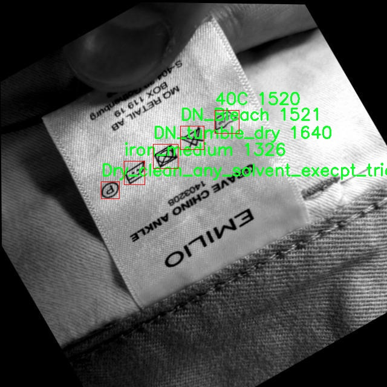

# 洗涤标签识别系统源码分享
 # [一条龙教学YOLOV8标注好的数据集一键训练_70+全套改进创新点发刊_Web前端展示]

### 1.研究背景与意义

项目参考[AAAI Association for the Advancement of Artificial Intelligence](https://gitee.com/qunmasj/projects)

项目来源[AACV Association for the Advancement of Computer Vision](https://kdocs.cn/l/cszuIiCKVNis)

研究背景与意义

随着社会的快速发展和人们生活水平的提高，服装行业的多样化和个性化需求日益增加，洗涤标签作为服装护理的重要信息载体，其识别与解析变得愈发重要。洗涤标签不仅为消费者提供了洗涤、干燥和熨烫等护理建议，还能有效延长服装的使用寿命，减少资源浪费。因此，开发一个高效、准确的洗涤标签识别系统，能够帮助消费者更好地理解和遵循护理指引，具有重要的实际意义。

近年来，计算机视觉技术的迅猛发展为物体检测和图像识别领域带来了新的机遇。YOLO（You Only Look Once）系列模型以其高效的实时检测能力和较高的准确率，逐渐成为物体检测领域的主流方法。YOLOv8作为该系列的最新版本，进一步提升了模型的性能和应用范围。基于YOLOv8的洗涤标签识别系统，能够实现对洗涤标签上各种护理指示的自动识别，为消费者提供更为便捷的服务。

本研究旨在基于改进的YOLOv8模型，构建一个高效的洗涤标签识别系统。我们将使用包含734张图像和46个类别的洗涤标签数据集，涵盖了30C至95C的水温指示、各种漂白剂使用建议、干燥和熨烫方式等30个不同的类目。这一数据集的多样性和丰富性为模型的训练和测试提供了坚实的基础，确保了系统在实际应用中的广泛适用性。

通过对YOLOv8模型的改进，我们期望在提高识别准确率的同时，降低计算复杂度，以便在移动设备和嵌入式系统中实现实时识别。这不仅能够满足消费者对快速获取洗涤信息的需求，还能为服装制造商、零售商提供数据支持，帮助他们更好地设计和推广符合消费者需求的产品。

此外，洗涤标签识别系统的研究还具有重要的社会意义。随着可持续发展理念的深入人心，消费者对服装护理的关注程度逐渐提高。通过智能化的洗涤标签识别系统，消费者能够更科学地进行服装护理，减少因错误洗涤而导致的资源浪费，进而推动整个服装行业向更加环保和可持续的方向发展。

综上所述，基于改进YOLOv8的洗涤标签识别系统的研究，不仅具有重要的学术价值和技术创新意义，还在实际应用中能够为消费者和行业带来切实的利益。通过本研究，我们希望能够为未来的智能洗涤标签识别技术的发展奠定基础，推动计算机视觉技术在服装护理领域的深入应用。

### 2.图片演示







##### 注意：由于此博客编辑较早，上面“2.图片演示”和“3.视频演示”展示的系统图片或者视频可能为老版本，新版本在老版本的基础上升级如下：（实际效果以升级的新版本为准）

  （1）适配了YOLOV8的“目标检测”模型和“实例分割”模型，通过加载相应的权重（.pt）文件即可自适应加载模型。

  （2）支持“图片识别”、“视频识别”、“摄像头实时识别”三种识别模式。

  （3）支持“图片识别”、“视频识别”、“摄像头实时识别”三种识别结果保存导出，解决手动导出（容易卡顿出现爆内存）存在的问题，识别完自动保存结果并导出到tempDir中。

  （4）支持Web前端系统中的标题、背景图等自定义修改，后面提供修改教程。

  另外本项目提供训练的数据集和训练教程,暂不提供权重文件（best.pt）,需要您按照教程进行训练后实现图片演示和Web前端界面演示的效果。

### 3.视频演示

[3.1 视频演示](https://www.bilibili.com/video/BV1JC2AYPEQ1/)

### 4.数据集信息展示

##### 4.1 本项目数据集详细数据（类别数＆类别名）

nc: 46
names: ['30C', '40C', '50C', '60C', '70C', '95C', 'Bleach', 'Chlorine_bleach', 'DN_Bleach', 'DN_dry', 'DN_dry_clean', 'DN_iron', 'DN_steam', 'DN_tumble_dry', 'DN_wash', 'DN_wiring', 'DN_wring', 'Drip_dry', 'Dry_clean', 'Dry_clean_any_solvent', 'Dry_clean_any_solvent_execpt_tricholoroethylene', 'Dry_clean_low_heat', 'Dry_clean_no_steam', 'Dry_clean_petrol_only', 'Dry_clean_reduced_moisture', 'Dry_clean_short_cycle', 'Dry_flat', 'Wet_clean', 'Wring', 'hand_wash', 'iron', 'iron_high', 'iron_low', 'iron_medium', 'line_dry', 'line_dry_in_shade', 'machine_wash_delicate', 'machine_wash_normal', 'machine_wash_permanent_press', 'natural_dry', 'non_chlorine_bleach', 'shade_dry', 'tumble_dry_low', 'tumble_dry_medium', 'tumble_dry_no_heat', 'tumble_dry_normal']


##### 4.2 本项目数据集信息介绍

数据集信息展示

在现代洗涤标签识别系统的研究中，数据集的构建与选择至关重要。本项目采用的“Care label”数据集专门设计用于训练和改进YOLOv8模型，以实现对洗涤标签的高效识别。该数据集包含46个类别，涵盖了洗涤、干燥、熨烫等多种洗涤指示符，旨在为机器学习模型提供丰富的样本，以提高其识别准确性和鲁棒性。

“Care label”数据集的类别多样性反映了现实生活中洗涤标签的复杂性和多样性。每个类别都对应着特定的洗涤和护理指示，这些指示不仅影响衣物的清洁效果，还关系到衣物的使用寿命和外观保持。例如，标签中的“30C”、“40C”、“50C”、“60C”、“70C”和“95C”分别表示不同的洗涤温度，这些温度指示对衣物的材质和颜色有着重要的影响，错误的洗涤温度可能导致衣物缩水或褪色。

此外，数据集中还包括多种干燥和熨烫指示，如“DN_dry”、“DN_iron”、“tumble_dry_low”等，这些指示为用户提供了如何处理衣物的具体指导。尤其是在现代快节奏的生活中，准确理解这些标签变得尤为重要。因此，数据集中的“machine_wash_delicate”、“hand_wash”、“line_dry”等类别能够帮助用户选择适合其衣物的洗涤方式，从而避免不必要的损坏。

值得注意的是，数据集中还包含了一些特殊的护理指示，如“Dry_clean_any_solvent”、“Dry_clean_petrol_only”和“non_chlorine_bleach”等，这些指示针对特定材质或污渍处理提供了指导，确保用户在清洗时能够采取适当的措施，避免使用不当的清洁剂或方法而导致衣物受损。

在数据集的构建过程中，确保样本的多样性和代表性是至关重要的。为此，数据集收集了来自不同品牌和类型的洗涤标签，确保模型在训练过程中能够接触到广泛的样本。这种多样性不仅提高了模型的泛化能力，也使其在实际应用中能够更好地适应不同的洗涤标签。

总之，“Care label”数据集为改进YOLOv8的洗涤标签识别系统提供了丰富的训练素材。通过对46个类别的深入学习，模型将能够更准确地识别和解析洗涤标签中的信息，从而为用户提供更为精准的洗涤建议和指导。这一数据集的构建不仅是技术进步的体现，更是对用户需求的深刻理解，旨在提升日常生活中的洗涤体验。











### 5.全套项目环境部署视频教程（零基础手把手教学）

[5.1 环境部署教程链接（零基础手把手教学）](https://www.ixigua.com/7404473917358506534?logTag=c807d0cbc21c0ef59de5)


[5.2 安装Python虚拟环境创建和依赖库安装视频教程链接（零基础手把手教学）](https://www.ixigua.com/7404474678003106304?logTag=1f1041108cd1f708b01a)

### 6.手把手YOLOV8训练视频教程（零基础小白有手就能学会）

[6.1 手把手YOLOV8训练视频教程（零基础小白有手就能学会）](https://www.ixigua.com/7404477157818401292?logTag=d31a2dfd1983c9668658)


按照上面的训练视频教程链接加载项目提供的数据集，运行train.py即可开始训练



     Epoch   gpu_mem       box       obj       cls    labels  img_size
     1/200     20.8G   0.01576   0.01955  0.007536        22      1280: 100%|██████████| 849/849 [14:42<00:00,  1.04s/it]
               Class     Images     Labels          P          R     mAP@.5 mAP@.5:.95: 100%|██████████| 213/213 [01:14<00:00,  2.87it/s]
                 all       3395      17314      0.994      0.957      0.0957      0.0843

     Epoch   gpu_mem       box       obj       cls    labels  img_size
     2/200     20.8G   0.01578   0.01923  0.007006        22      1280: 100%|██████████| 849/849 [14:44<00:00,  1.04s/it]
               Class     Images     Labels          P          R     mAP@.5 mAP@.5:.95: 100%|██████████| 213/213 [01:12<00:00,  2.95it/s]
                 all       3395      17314      0.996      0.956      0.0957      0.0845

     Epoch   gpu_mem       box       obj       cls    labels  img_size
     3/200     20.8G   0.01561    0.0191  0.006895        27      1280: 100%|██████████| 849/849 [10:56<00:00,  1.29it/s]
               Class     Images     Labels          P          R     mAP@.5 mAP@.5:.95: 100%|███████   | 187/213 [00:52<00:00,  4.04it/s]
                 all       3395      17314      0.996      0.957      0.0957      0.0845


### 7.70+种全套YOLOV8创新点代码加载调参视频教程（一键加载写好的改进模型的配置文件）

[7.1 70+种全套YOLOV8创新点代码加载调参视频教程（一键加载写好的改进模型的配置文件）](https://www.ixigua.com/7404478314661806627?logTag=29066f8288e3f4eea3a4)

### 8.70+种全套YOLOV8创新点原理讲解（非科班也可以轻松写刊发刊，V10版本正在科研待更新）

#### 由于篇幅限制，每个创新点的具体原理讲解就不一一展开，具体见下列网址中的创新点对应子项目的技术原理博客网址【Blog】：


[8.1 70+种全套YOLOV8创新点原理讲解链接](https://gitee.com/qunmasj/good)

#### 部分改进原理讲解(完整的改进原理见上图和技术博客链接)【如果此小节的图加载失败可以通过CSDN或者Github搜索该博客的标题访问原始博客，原始博客图片显示正常】
### YOLOv8简介

YOLOv8是一种最新的SOTA算法，提供了N/S/M/L/X尺度的不同大小模型，以满足不同场景的需求。本章对算法网络的新特性进行简要介绍。


1）骨干网络和Neck
开发者设计了C2f模块对CSPDarkNet 53和PAFPN进行改造。相比C3模块，C2f模块拥有更多的分支跨层链接，使模型的梯度流更加丰富，显著增强了模型的特征提取能力。
2)Head部分
Head部分采用无锚框设计，将分类任务和回归任务进行了解耦，独立的分支将更加专注于其所负责的特征信息。
3）损失计算
模型使用CIOU Loss作为误差损失函数，并通过最小化DFL进一步提升边界框的回归精度。同时模型采用了TaskAlignedAssigner样本分配策略，以分类得分和IOU的高阶组合作为指标指导正负样本选择，实现了高分类得分和高IOU的对齐，有效地提升了模型的检测精度。


### D-LKA Attention简介
自2010年代中期以来，卷积神经网络（CNNs）已成为许多计算机视觉应用的首选技术。它们能够从原始数据中自动提取复杂的特征表示，无需手动进行特征工程，这引起了医学图像分析社区的极大兴趣。许多成功的CNN架构，如U-Net、全卷积网络、DeepLab或SegCaps（分割胶囊），已经被开发出来。这些架构在语义分割任务中取得了巨大成功，先前的最新方法已经被超越。

在计算机视觉研究中，不同尺度下的目标识别是一个关键问题。在CNN中，可检测目标的大小与相应网络层的感受野尺寸密切相关。如果一个目标扩展到超出这个感受野的边界，这可能会导致欠分割结果。相反，与目标实际大小相比使用过大的感受野可能会限制识别，因为背景信息可能会对预测产生不必要的影响。

解决这个问题的一个有希望的方法涉及在并行使用具有不同尺寸的多个Kernel，类似于Inception块的机制。然而，由于参数和计算要求的指数增长，将Kernel大小增加以容纳更大的目标在实践中受到限制。因此，出现了各种策略，包括金字塔池化技术和不同尺度的扩张卷积，以捕获多尺度的上下文信息。

另一个直观的概念涉及将多尺度图像金字塔或它们的相关特征表示直接纳入网络架构。然而，这种方法存在挑战，特别是在管理训练和推理时间方面的可行性方面存在挑战。在这个背景下，使用编码器-解码器网络，如U-Net，已被证明是有利的。这样的网络在较浅的层中编码外观和位置，而在更深的层中，通过神经元的更广泛的感受野捕获更高的语义信息和上下文信息。

一些方法将来自不同层的特征组合在一起，或者预测来自不同尺寸的层的特征以使用多尺度的信息。此外，出现了从不同尺度的层中预测特征的方法，有效地实现了跨多个尺度的见解整合。然而，大多数编码器-解码器结构面临一个挑战：它们经常无法在不同尺度之间保持一致的特征，并主要使用最后一个解码器层生成分割结果。

语义分割是一项任务，涉及根据预定义的标签集为图像中的每个像素预测语义类别。这项任务要求提取高级特征同时保留初始的空间分辨率。CNNs非常适合捕获局部细节和低级信息，尽管以忽略全局上下文为代价。视觉Transformer（ViT）架构已经成为解决处理全局信息的视觉任务的关键，包括语义分割，取得了显著的成功。

ViT的基础是注意力机制，它有助于在整个输入序列上聚合信息。这种能力使网络能够合并远程的上下文提示，超越了CNN的有限感受野尺寸。然而，这种策略通常会限制ViT有效建模局部信息的能力。这种局限可能会妨碍它们检测局部纹理的能力，这对于各种诊断和预测任务至关重要。这种缺乏局部表示可以归因于ViT模型处理图像的特定方式。

ViT模型将图像分成一系列Patch，并使用自注意力机制来模拟它们之间的依赖关系。这种方法可能不如CNN模型中的卷积操作对感受野内提取局部特征有效。ViT和CNN模型之间的这种图像处理方法的差异可能解释了CNN模型在局部特征提取方面表现出色的原因。

近年来，已经开发出创新性方法来解决Transformer模型内部局部纹理不足的问题。其中一种方法是通过互补方法将CNN和ViT特征结合起来，以结合它们的优势并减轻局部表示的不足。TransUNet是这种方法的早期示例，它在CNN的瓶颈中集成了Transformer层，以模拟局部和全局依赖关系。HiFormer提出了一种解决方案，将Swin Transformer模块和基于CNN的编码器结合起来，生成两个多尺度特征表示，通过Double-Level Fusion模块集成。UNETR使用基于Transformer的编码器和CNN解码器进行3D医学图像分割。CoTr和TransBTS通过Transformer在低分辨率阶段增强分割性能，将CNN编码器和解码器连接在一起。

增强局部特征表示的另一种策略是重新设计纯Transformer模型内部的自注意力机制。在这方面，Swin-Unet在U形结构中集成了一个具有线性计算复杂性的Swin Transformer块作为多尺度 Backbone 。MISSFormer采用高效Transformer来解决视觉Transformer中的参数问题，通过在输入块上进行不可逆的降采样操作。D-Former引入了一个纯Transformer的管道，具有双重注意模块，以分段的方式捕获细粒度的局部注意和与多元单元的交互。然而，仍然存在一些特定的限制，包括计算效率低下，如TransUNet模型所示，对CNN Backbone 的严重依赖，如HiFormer所观察到的，以及对多尺度信息的忽略。

此外，目前的分割架构通常采用逐层处理3D输入 volumetric 的方法，无意中忽视了相邻切片之间的潜在相关性。这一疏忽限制了对 volumetric 信息的全面利用，因此损害了定位精度和上下文集成。此外，必须认识到，医学领域的病变通常在形状上发生变形。因此，用于医学图像分析的任何学习算法都必须具备捕捉和理解这些变形的能力。与此同时，该算法应保持计算效率，以便处理3D volumetric数据。

为了解决上述提到的挑战，作者提出了一个解决方案，即可变形大卷积核注意力模块（Deformable LKA module），它是作者网络设计的基本构建模块。这个模块明确设计成在有效处理上下文信息的同时保留局部描述符。作者的架构在这两个方面的平衡增强了实现精确语义分割的能力。

值得注意的是，参考该博客引入了一种基于数据的感受野的动态适应，不同于传统卷积操作中的固定滤波器Mask。这种自适应方法使作者能够克服与静态方法相关的固有限制。这种创新方法还扩展到了D-LKA Net架构的2D和3D版本的开发。

在3D模型的情况下，D-LKA机制被量身定制以适应3D环境，从而实现在不同 volumetric 切片之间无缝信息交互。最后，作者的贡献通过其计算效率得到进一步强调。作者通过仅依靠D-LKA概念的设计来实现这一点，在各种分割基准上取得了显著的性能，确立了作者的方法作为一种新的SOTA方法。

在本节中，作者首先概述方法论。首先，作者回顾了由Guo等人引入的大卷积核注意力（Large Kernel Attention，LKA）的概念。然后，作者介绍了作者对可变形LKA模块的创新探索。在此基础上，作者介绍了用于分割任务的2D和3D网络架构。

大卷积核提供了与自注意力机制类似的感受野。可以通过使用深度卷积、深度可扩展卷积和卷积来构建大卷积核，从而减少了参数和计算量。构建输入维度为和通道数的卷积核的深度卷积和深度可扩展卷积的卷积核大小的方程如下：


具有卷积核大小和膨胀率。参数数量和浮点运算（FLOPs）的计算如下：


FLOPs的数量与输入图像的大小成线性增长。参数的数量随通道数和卷积核大小的增加而呈二次增长。然而，由于它们通常都很小，因此它们不是限制因素。

为了最小化对于固定卷积核大小K的参数数量，可以将方程3对于膨胀率的导数设定为零：


例如，当卷积核大小为时，结果是。将这些公式扩展到3D情况是直接的。对于大小为和通道数C的输入，3D情况下参数数量和FLOPs 的方程如下：


具有卷积核大小和膨胀。


利用大卷积核进行医学图像分割的概念通过引入可变形卷积得以扩展。可变形卷积可以通过整数偏移自由调整采样网格以进行自由变形。额外的卷积层从特征图中学习出变形，从而创建一个偏移场。基于特征本身学习变形会导致自适应卷积核。这种灵活的卷积核形状可以提高病变或器官变形的表示，从而增强了目标边界的定义。

负责计算偏移的卷积层遵循其相应卷积层的卷积核大小和膨胀。双线性插值用于计算不在图像网格上的偏移的像素值。如图2所示，D-LKA模块可以表示为：


其中输入特征由表示，。表示为注意力图，其中每个值表示相应特征的相对重要性。运算符  表示逐元素乘法运算。值得注意的是，LKA不同于传统的注意力方法，它不需要额外的规范化函数，如或。这些规范化函数往往忽视高频信息，从而降低了基于自注意力的方法的性能。

在该方法的2D版本中，卷积层被可变形卷积所替代，因为可变形卷积能够改善对具有不规则形状和大小的目标的捕捉能力。这些目标在医学图像数据中常常出现，因此这种增强尤为重要。

然而，将可变形LKA的概念扩展到3D领域会带来一定的挑战。主要的约束来自于需要用于生成偏移的额外卷积层。与2D情况不同，由于输入和输出通道的性质，这一层无法以深度可分的方式执行。在3D环境中，输入通道对应于特征，而输出通道扩展到，其中是卷积核的大小。大卷积核的复杂性导致沿第3D的通道数扩展，导致参数和FLOPs大幅增加。因此，针对3D情况采用了另一种替代方法。在现有的LKA框架中，深度卷积之后引入了一个单独的可变形卷积层。这种战略性的设计调整旨在减轻扩展到3D领域所带来的挑战。


2D网络的架构如图1所示。第一变种使用MaxViT作为编码器组件，用于高效特征提取，而第二变种则结合可变形LKA层进行更精细、卓越的分割。

在更正式的描述中，编码器生成4个分层输出表示。首先，卷积干扰将输入图像的维度减小到。随后，通过4个MaxViT块的4个阶段进行特征提取，每个阶段后跟随降采样层。随着过程进展到解码器，实施了4个阶段的D-LKA层，每个阶段包含2个D-LKA块。然后，应用Patch扩展层以实现分辨率上采样，同时减小通道维度。最后，线性层负责生成最终的输出。

2D D-LKA块的结构包括LayerNorm、可变形LKA和多层感知器（MLP）。积分残差连接确保了有效的特征传播，即使在更深层也是如此。这个安排可以用数学方式表示为：


其中输入特征，层归一化LN，可变形LKA注意力，深度卷积，线性层和GeLU激活函数。

3D网络架构如图1所示，采用编码器-解码器设计进行分层结构化。首先，一个Patch嵌入层将输入图像的维度从（）减小到（）。在编码器中，采用了3个D-LKA阶段的序列，每个阶段包含3个D-LKA块。在每个阶段之后，通过降采样步骤将空间分辨率减半，同时将通道维度加倍。中央瓶颈包括另一组2个D-LKA块。解码器结构与编码器相对称。

为了将特征分辨率加倍，同时减少通道数，使用转置卷积。每个解码器阶段都使用3个D-LKA块来促进远距离特征依赖性。最终的分割输出由一个卷积层产生，后面跟随一个卷积层以匹配特定类别的通道要求。

为了建立输入图像和分割输出之间的直接连接，使用卷积形成了一个跳跃连接。额外的跳跃连接根据简单的加法对来自其他阶段的特征进行融合。最终的分割图是通过和卷积层的组合产生的。

3D D-LKA块包括层归一化，后跟D-LKA注意力，应用了残差连接的部分。随后的部分采用了一个卷积层，后面跟随一个卷积层，两者都伴随着残差连接。这个整个过程可以总结如下：


带有输入特征 、层归一化 、可变形 LKA 、卷积层 和输出特征 的公式。是指一个前馈网络，包括2个卷积层和激活函数。

表7显示了普通卷积和构建卷积的参数数量比较。尽管标准卷积的参数数量在通道数较多时急剧增加，但分解卷积的参数总体较低，并且增长速度不那么快。

与分解卷积相比，可变形分解卷积增加了大量参数，但仍然明显小于标准卷积。可变形卷积的主要参数是由偏移网络创建的。在这里，作者假设可变形深度卷积的Kernel大小为（5,5），可变形深度空洞卷积的Kernel大小为（7,7）。这导致了21×21大小的大Kernel的最佳参数数量。更高效地生成偏移量的方法将大大减少参数数量。


值得注意的是，引入可变形LKA确实会增加模型的参数数量和每秒的浮点运算次数（FLOPS）。然而，重要的是强调，这增加的计算负载不会影响作者模型的整体推理速度。

相反，对于Batch-size > 1，作者甚至观察到推理时间的减少，如图7所示。例如，基于作者的广泛实验，作者观察到对于Batch-size为16，具有可变形卷积和没有可变形卷积的推理时间分别为8.01毫秒和17.38毫秒。作者认为这是由于在2D中对可变形卷积的高效实现所致。为了测量时间，使用了大小为（）的随机输入。在GPU热身周期50次迭代之后，网络被推断了1000次。测量是在NVIDIA RTX 3090 GPU上进行的。


为了充分利用性能与参数之间的权衡关系，作者在图8中可视化了在Synapse 2D数据集上报告的DSC和HD性能以及基于参数数量的内存消耗。D-LKA Net引入了相当多的参数，约为101M。这比性能第二好的方法ScaleFormer使用的111.6M参数要少。

与更轻量级的DAEFormer模型相比，作者实现了更好的性能，这证明了参数增加的合理性。大多数参数来自于MaxViT编码器；因此，将编码器替换为更高效的编码器可以减少模型参数。值得注意的是，在此可视化中，作者最初将HD和内存值都归一化到[0, 100]范围内。随后，作者将它们从100缩小，以增强更高值的表示。


### 9.系统功能展示（检测对象为举例，实际内容以本项目数据集为准）

图9.1.系统支持检测结果表格显示

  图9.2.系统支持置信度和IOU阈值手动调节

  图9.3.系统支持自定义加载权重文件best.pt(需要你通过步骤5中训练获得)

  图9.4.系统支持摄像头实时识别

  图9.5.系统支持图片识别

  图9.6.系统支持视频识别

  图9.7.系统支持识别结果文件自动保存

  图9.8.系统支持Excel导出检测结果数据


### 10.原始YOLOV8算法原理

原始YOLOv8算法原理

YOLOv8算法作为目标检测领域的最新进展，自2023年1月由Ultralytics发布以来，迅速引起了广泛关注。它不仅继承了YOLO系列算法的优良传统，还吸收了YOLOX、YOLOv6、YOLOv7以及PPYOLOE等前辈算法的设计理念，尤其在Head标签分配和Loss计算方面与PP-YOLOE有着显著的相似性。这种“集百家所长”的设计理念，使得YOLOv8在实时检测的精度和速度上达到了一个新的高度，标志着目标检测技术的又一次飞跃。

YOLOv8的结构设计可以分为四个主要部分：输入模块、Backbone骨干网络、Neck特征融合网络和Head检测模块。输入模块的主要功能是对输入图像进行预处理，包括调整图像比例、实现Mosaic增强以及瞄点计算等。这些预处理步骤不仅提高了数据的多样性，还增强了模型对不同场景的适应能力。通过Mosaic增强，YOLOv8能够在训练过程中接触到更丰富的图像特征，从而提升模型的泛化能力。

在Backbone部分，YOLOv8延续了DarkNet的结构，但进行了重要的优化。与之前的YOLO版本不同，YOLOv8采用了C2f模块替代了C3模块，这一改进旨在增强梯度流动信息的丰富性，同时保持了轻量级特性。C2f模块通过引入跨级连接，能够有效地整合来自不同层次的特征信息，从而提升了特征提取的效率和准确性。此外，YOLOv8还通过SPPF模块对输出特征图进行处理，利用不同内核尺寸的池化对特征图进行合并，这一过程为后续的特征融合奠定了基础。

Neck部分的设计同样值得关注，YOLOv8采用了“双塔结构”，将特征金字塔与路径聚合网络相结合。这种设计促进了语义特征与定位特征之间的有效转移，使得网络能够获取更丰富的特征信息，从而在不同尺度目标的检测中表现出色。特征金字塔的引入使得YOLOv8能够在多尺度下进行目标检测，极大地提升了模型对小目标的识别能力。

在Head检测模块中，YOLOv8引入了解耦头的结构，将回归分支和预测分支进行分离。这一设计不仅加速了模型的收敛速度，还提高了检测的精度。YOLOv8的检测模块包含三个Detect检测器，分别负责不同的任务，通过解耦结构，模型能够更灵活地处理复杂的目标检测任务。

YOLOv8的算法思想体现了对目标检测精度和速度的双重追求。它在骨干网络中依然采用了跨级结构（Cross Stage Partial, CSP）的思想，但对YOLOv5中的C3模块进行了优化，替换为更加轻量的结构。这样的设计使得YOLOv8在保持高效性的同时，能够更好地适应实时检测的需求。此外，YOLOv8保留了空间金字塔池化模块，进一步增强了特征提取的能力。

在损失函数的设计上，YOLOv8采用了新的损失策略，通过变焦损失计算分类损失，使用数据平均保真度损失和完美交并比损失对边界框损失进行计算。这种创新的损失计算方式，使得YOLOv8在目标检测的准确性上有了显著提升。通过引入新的样本匹配方式，YOLOv8能够在高效率的基础上，进行更加准确的目标检测，展现出强大的应用潜力。

总的来说，YOLOv8的设计理念和技术创新使其在目标检测领域脱颖而出。它不仅提升了检测精度和速度，还为各种实际应用提供了强有力的支持。无论是在苹果采摘等农业领域，还是在其他需要实时目标检测的场景中，YOLOv8都展现出了极大的应用价值。通过结合蚁群算法进行路径规划，自动采摘机器人能够快速而高效地完成苹果的采摘任务，这无疑为农业生产的智能化和自动化提供了新的解决方案。

在未来的发展中，YOLOv8的进一步优化和应用将继续推动目标检测技术的进步，尤其是在精度、速度和适应性等方面的提升，将为更多行业带来深远的影响。随着YOLOv8的广泛应用，我们有理由相信，目标检测技术将在各个领域迎来新的发展机遇。


### 11.项目核心源码讲解（再也不用担心看不懂代码逻辑）

#### 11.1 70+种YOLOv8算法改进源码大全和调试加载训练教程（非必要）\ultralytics\trackers\basetrack.py

以下是对代码的核心部分进行保留和详细注释的结果：

```python
# Ultralytics YOLO 🚀, AGPL-3.0 license

from collections import OrderedDict
import numpy as np

class TrackState:
    """跟踪状态的枚举类，表示物体的不同跟踪状态。"""
    New = 0      # 新物体
    Tracked = 1  # 正在跟踪
    Lost = 2     # 丢失
    Removed = 3  # 被移除

class BaseTrack:
    """物体跟踪的基类，处理基本的跟踪属性和操作。"""

    _count = 0  # 全局跟踪ID计数器

    track_id = 0  # 当前跟踪的ID
    is_activated = False  # 跟踪是否被激活
    state = TrackState.New  # 当前跟踪状态

    history = OrderedDict()  # 跟踪历史记录
    features = []  # 特征列表
    curr_feature = None  # 当前特征
    score = 0  # 跟踪得分
    start_frame = 0  # 开始帧
    frame_id = 0  # 当前帧ID
    time_since_update = 0  # 自上次更新以来的时间

    # 多摄像头位置
    location = (np.inf, np.inf)  # 初始位置设为无穷大

    @property
    def end_frame(self):
        """返回跟踪的最后帧ID。"""
        return self.frame_id

    @staticmethod
    def next_id():
        """递增并返回全局跟踪ID计数器。"""
        BaseTrack._count += 1
        return BaseTrack._count

    def activate(self, *args):
        """激活跟踪，使用提供的参数。"""
        raise NotImplementedError  # 该方法需要在子类中实现

    def predict(self):
        """预测跟踪的下一个状态。"""
        raise NotImplementedError  # 该方法需要在子类中实现

    def update(self, *args, **kwargs):
        """使用新的观测值更新跟踪。"""
        raise NotImplementedError  # 该方法需要在子类中实现

    def mark_lost(self):
        """将跟踪标记为丢失。"""
        self.state = TrackState.Lost

    def mark_removed(self):
        """将跟踪标记为移除。"""
        self.state = TrackState.Removed

    @staticmethod
    def reset_id():
        """重置全局跟踪ID计数器。"""
        BaseTrack._count = 0
```

### 代码分析与注释

1. **TrackState 类**：定义了物体跟踪的不同状态，方便在跟踪过程中管理和更新状态。

2. **BaseTrack 类**：作为物体跟踪的基类，提供了跟踪的基本属性和方法。包括跟踪ID、状态、历史记录、特征等。

3. **属性与方法**：
   - `end_frame`：计算并返回跟踪的最后一帧ID。
   - `next_id`：静态方法，用于生成唯一的跟踪ID。
   - `activate`、`predict`、`update`：这些方法需要在子类中实现，定义了如何激活跟踪、预测下一个状态和更新跟踪。
   - `mark_lost` 和 `mark_removed`：用于更新跟踪状态，分别标记为丢失和移除。
   - `reset_id`：重置跟踪ID计数器，通常在重新开始跟踪时使用。

通过这些核心部分和注释，可以清晰地理解该代码的结构和功能。

这个文件是一个关于目标跟踪的基础类实现，主要用于YOLO（You Only Look Once）算法中的目标跟踪部分。文件中定义了一个跟踪状态的枚举类和一个基础跟踪类，提供了目标跟踪所需的基本属性和操作。

首先，`TrackState`类定义了四种可能的目标跟踪状态：新建（New）、跟踪中（Tracked）、丢失（Lost）和已移除（Removed）。这些状态用于表示目标在跟踪过程中的不同阶段。

接下来是`BaseTrack`类，它是目标跟踪的基础类，包含了一些基本的跟踪属性和方法。该类中定义了一个类变量`_count`，用于跟踪全局的目标ID计数。每个跟踪对象都有一个唯一的`track_id`，并且可以通过`next_id`静态方法来获取下一个可用的ID。

`BaseTrack`类中还包含了一些属性，例如`is_activated`表示该跟踪是否被激活，`state`表示当前的跟踪状态，`history`用于存储跟踪历史，`features`和`curr_feature`用于存储特征信息，`score`表示跟踪的置信度分数，`start_frame`和`frame_id`用于记录跟踪的起始帧和当前帧，`time_since_update`用于记录自上次更新以来的时间。此外，`location`属性用于多摄像头场景下的位置信息。

类中还定义了一些方法，包括`activate`（激活跟踪）、`predict`（预测下一个状态）、`update`（更新跟踪）等。这些方法目前都是未实现的，表示需要在子类中进行具体实现。`mark_lost`和`mark_removed`方法用于将跟踪状态标记为丢失或已移除。

最后，`reset_id`静态方法用于重置全局的跟踪ID计数。这一设计使得在跟踪过程中可以灵活地管理目标的ID和状态，便于后续的跟踪和管理。

总体而言，这个文件为YOLO算法中的目标跟踪提供了一个基础框架，后续可以在此基础上进行具体的跟踪算法实现和优化。

#### 11.2 code\ultralytics\data\build.py

以下是代码中最核心的部分，并附上详细的中文注释：

```python
import os
import random
import numpy as np
import torch
from torch.utils.data import dataloader, distributed
from .dataset import YOLODataset
from .utils import PIN_MEMORY

class InfiniteDataLoader(dataloader.DataLoader):
    """
    无限循环的数据加载器，重用工作线程。
    继承自标准的 DataLoader，使用相同的语法。
    """

    def __init__(self, *args, **kwargs):
        """初始化无限循环的数据加载器，继承自 DataLoader。"""
        super().__init__(*args, **kwargs)
        # 设置一个重复采样器，确保数据可以无限循环
        object.__setattr__(self, "batch_sampler", _RepeatSampler(self.batch_sampler))
        self.iterator = super().__iter__()

    def __len__(self):
        """返回批次采样器的长度。"""
        return len(self.batch_sampler.sampler)

    def __iter__(self):
        """创建一个无限循环的迭代器。"""
        for _ in range(len(self)):
            yield next(self.iterator)

    def reset(self):
        """
        重置迭代器。
        当我们想在训练过程中修改数据集设置时，这个方法非常有用。
        """
        self.iterator = self._get_iterator()

class _RepeatSampler:
    """
    无限循环的采样器。
    
    参数:
        sampler (Dataset.sampler): 要重复的采样器。
    """

    def __init__(self, sampler):
        """初始化一个可以无限重复给定采样器的对象。"""
        self.sampler = sampler

    def __iter__(self):
        """迭代给定的采样器并返回其内容。"""
        while True:
            yield from iter(self.sampler)

def seed_worker(worker_id):
    """设置数据加载器工作线程的随机种子。"""
    worker_seed = torch.initial_seed() % 2**32  # 获取当前线程的随机种子
    np.random.seed(worker_seed)  # 设置numpy的随机种子
    random.seed(worker_seed)  # 设置python的随机种子

def build_yolo_dataset(cfg, img_path, batch, data, mode="train", rect=False, stride=32):
    """构建YOLO数据集。"""
    return YOLODataset(
        img_path=img_path,  # 图像路径
        imgsz=cfg.imgsz,  # 图像大小
        batch_size=batch,  # 批次大小
        augment=mode == "train",  # 是否进行数据增强
        hyp=cfg,  # 超参数配置
        rect=cfg.rect or rect,  # 是否使用矩形批次
        cache=cfg.cache or None,  # 是否缓存数据
        single_cls=cfg.single_cls or False,  # 是否单类检测
        stride=int(stride),  # 步幅
        pad=0.0 if mode == "train" else 0.5,  # 填充
        prefix=colorstr(f"{mode}: "),  # 模式前缀
        task=cfg.task,  # 任务类型
        classes=cfg.classes,  # 类别
        data=data,  # 数据配置
        fraction=cfg.fraction if mode == "train" else 1.0,  # 训练时的样本比例
    )

def build_dataloader(dataset, batch, workers, shuffle=True, rank=-1):
    """返回用于训练或验证集的 InfiniteDataLoader 或 DataLoader。"""
    batch = min(batch, len(dataset))  # 确保批次大小不超过数据集大小
    nd = torch.cuda.device_count()  # 获取CUDA设备数量
    nw = min([os.cpu_count() // max(nd, 1), workers])  # 计算工作线程数量
    sampler = None if rank == -1 else distributed.DistributedSampler(dataset, shuffle=shuffle)  # 分布式采样器
    generator = torch.Generator()  # 创建随机数生成器
    generator.manual_seed(6148914691236517205 + RANK)  # 设置随机种子
    return InfiniteDataLoader(
        dataset=dataset,  # 数据集
        batch_size=batch,  # 批次大小
        shuffle=shuffle and sampler is None,  # 是否打乱数据
        num_workers=nw,  # 工作线程数量
        sampler=sampler,  # 采样器
        pin_memory=PIN_MEMORY,  # 是否将数据加载到固定内存
        collate_fn=getattr(dataset, "collate_fn", None),  # 合并函数
        worker_init_fn=seed_worker,  # 工作线程初始化函数
        generator=generator,  # 随机数生成器
    )

def load_inference_source(source=None, imgsz=640, vid_stride=1, buffer=False):
    """
    加载用于目标检测的推理源并应用必要的转换。

    参数:
        source (str, Path, Tensor, PIL.Image, np.ndarray): 输入源。
        imgsz (int, optional): 推理图像大小，默认为640。
        vid_stride (int, optional): 视频源的帧间隔，默认为1。
        buffer (bool, optional): 是否缓冲流帧，默认为False。

    返回:
        dataset (Dataset): 指定输入源的数据集对象。
    """
    # 检查源类型并返回相应的标志值
    source, webcam, screenshot, from_img, in_memory, tensor = check_source(source)
    
    # 根据源类型选择相应的加载方式
    if tensor:
        dataset = LoadTensor(source)  # 加载张量
    elif in_memory:
        dataset = source  # 使用内存中的数据
    elif webcam:
        dataset = LoadStreams(source, imgsz=imgsz, vid_stride=vid_stride, buffer=buffer)  # 加载摄像头流
    elif screenshot:
        dataset = LoadScreenshots(source, imgsz=imgsz)  # 加载屏幕截图
    elif from_img:
        dataset = LoadPilAndNumpy(source, imgsz=imgsz)  # 加载PIL或numpy图像
    else:
        dataset = LoadImages(source, imgsz=imgsz, vid_stride=vid_stride)  # 加载图像文件

    # 将源类型附加到数据集
    setattr(dataset, "source_type", source_type)

    return dataset  # 返回构建好的数据集
```

以上代码是YOLO目标检测模型中数据加载的核心部分，包含了无限循环的数据加载器、数据集构建和推理源加载等功能。每个函数和类都附有详细的中文注释，便于理解其功能和用途。

这个程序文件是用于构建和管理YOLO（You Only Look Once）模型的数据加载器和数据集的。它主要包含了几个重要的类和函数，用于处理数据的加载、增强和迭代。

首先，`InfiniteDataLoader`类是一个自定义的数据加载器，继承自PyTorch的`DataLoader`。它的特点是可以无限循环使用工作线程，适合于需要持续训练的场景。该类重写了`__len__`和`__iter__`方法，使得每次迭代都能返回新的批次数据。它还提供了一个`reset`方法，用于在训练过程中重置迭代器，以便可以在训练时修改数据集的设置。

`_RepeatSampler`类是一个辅助类，用于实现无限重复的采样器。它会不断迭代给定的采样器，确保在训练过程中可以持续获取数据。

`seed_worker`函数用于设置数据加载器工作线程的随机种子，以确保每次训练的随机性一致性，避免因随机性导致的训练结果不稳定。

`build_yolo_dataset`函数用于构建YOLO数据集，接收配置参数、图像路径、批次大小等信息，并返回一个`YOLODataset`实例。这个函数会根据训练模式（如训练或验证）设置数据增强、批次形状等参数。

`build_dataloader`函数用于创建一个数据加载器，支持无限循环的特性。它会根据可用的CUDA设备数量和CPU核心数量来设置工作线程的数量，并根据分布式训练的需求选择合适的采样器。

`check_source`函数用于检查输入源的类型，并返回相应的标志值。它支持多种输入类型，包括文件路径、URL、图像、视频流等，并根据输入类型进行相应的处理。

`load_inference_source`函数用于加载推理源，适用于目标检测任务。它会根据输入源的类型调用不同的加载器，并返回一个数据集对象。这个函数支持从多种来源加载数据，包括张量、图像、视频流等，并应用必要的转换。

整体来看，这个文件的主要功能是提供一个灵活且高效的数据加载和处理框架，以支持YOLO模型的训练和推理过程。通过这些类和函数，用户可以方便地管理数据集、设置数据增强、处理不同类型的输入源，从而提高模型的训练效率和准确性。

#### 11.3 ui.py

```python
import sys
import subprocess

def run_script(script_path):
    """
    使用当前 Python 环境运行指定的脚本。

    Args:
        script_path (str): 要运行的脚本路径

    Returns:
        None
    """
    # 获取当前 Python 解释器的路径
    python_path = sys.executable

    # 构建运行命令，使用 streamlit 运行指定的脚本
    command = f'"{python_path}" -m streamlit run "{script_path}"'

    # 执行命令并等待其完成
    result = subprocess.run(command, shell=True)
    
    # 检查命令执行结果，如果返回码不为0，则表示出错
    if result.returncode != 0:
        print("脚本运行出错。")


# 主程序入口
if __name__ == "__main__":
    # 指定要运行的脚本路径
    script_path = "web.py"  # 假设脚本在当前目录下

    # 调用函数运行脚本
    run_script(script_path)
```

### 代码注释说明：
1. **导入模块**：
   - `sys`：用于访问与 Python 解释器紧密相关的变量和函数。
   - `subprocess`：用于执行外部命令。

2. **`run_script` 函数**：
   - 该函数接收一个脚本路径作为参数，并在当前 Python 环境中运行该脚本。
   - 使用 `sys.executable` 获取当前 Python 解释器的路径，以确保使用正确的 Python 版本。
   - 构建命令字符串，使用 `streamlit` 模块运行指定的脚本。
   - 使用 `subprocess.run` 执行命令，并等待其完成。
   - 检查命令的返回码，如果不为0，表示脚本运行出错，打印错误信息。

3. **主程序入口**：
   - 使用 `if __name__ == "__main__":` 确保只有在直接运行该脚本时才会执行以下代码。
   - 指定要运行的脚本路径（这里假设为 `web.py`）。
   - 调用 `run_script` 函数，传入脚本路径以执行该脚本。

这个程序文件名为 `ui.py`，其主要功能是通过当前的 Python 环境来运行一个指定的脚本。程序首先导入了必要的模块，包括 `sys`、`os` 和 `subprocess`，以及一个自定义的路径处理模块 `abs_path`。

在 `run_script` 函数中，程序接收一个参数 `script_path`，这个参数是要运行的脚本的路径。函数内部首先获取当前 Python 解释器的路径，接着构建一个命令字符串，这个命令使用 `streamlit` 模块来运行指定的脚本。具体来说，命令的格式是 `"{python_path}" -m streamlit run "{script_path}"`，其中 `python_path` 是当前 Python 解释器的路径，`script_path` 是传入的脚本路径。

然后，程序使用 `subprocess.run` 方法来执行这个命令，`shell=True` 参数表示在一个新的 shell 中执行命令。执行后，程序检查返回的结果，如果返回码不为 0，表示脚本运行出错，此时会打印出“脚本运行出错。”的提示信息。

在文件的最后部分，程序通过 `if __name__ == "__main__":` 语句来确保只有在直接运行该文件时才会执行以下代码。这里指定了要运行的脚本路径为 `web.py`，并调用 `run_script` 函数来执行这个脚本。

总体来看，这个程序的设计目的是为了方便地运行一个名为 `web.py` 的脚本，使用的是 `streamlit` 这个库来进行 web 应用的开发和展示。

#### 11.4 code\ultralytics\nn\modules\utils.py

以下是代码中最核心的部分，并附上详细的中文注释：

```python
import torch
import torch.nn.functional as F

def multi_scale_deformable_attn_pytorch(
    value: torch.Tensor,
    value_spatial_shapes: torch.Tensor,
    sampling_locations: torch.Tensor,
    attention_weights: torch.Tensor,
) -> torch.Tensor:
    """
    多尺度可变形注意力机制。

    参数:
    - value: 输入特征图，形状为 (batch_size, 通道数, num_heads, embed_dims)
    - value_spatial_shapes: 特征图的空间形状，形状为 (num_levels, 2)，每一行包含高和宽
    - sampling_locations: 采样位置，形状为 (batch_size, num_queries, num_heads, num_levels, num_points, 2)
    - attention_weights: 注意力权重，形状为 (batch_size, num_heads, num_queries, num_levels, num_points)

    返回:
    - output: 经过多尺度可变形注意力后的输出，形状为 (batch_size, num_queries, num_heads * embed_dims)
    """

    # 获取输入的维度信息
    bs, _, num_heads, embed_dims = value.shape
    _, num_queries, _, num_levels, num_points, _ = sampling_locations.shape

    # 将输入特征图根据空间形状拆分成多个特征图
    value_list = value.split([H_ * W_ for H_, W_ in value_spatial_shapes], dim=1)

    # 将采样位置转换到[-1, 1]范围
    sampling_grids = 2 * sampling_locations - 1
    sampling_value_list = []

    # 遍历每个尺度的特征图
    for level, (H_, W_) in enumerate(value_spatial_shapes):
        # 将特征图重塑为 (bs * num_heads, embed_dims, H_, W_)
        value_l_ = value_list[level].flatten(2).transpose(1, 2).reshape(bs * num_heads, embed_dims, H_, W_)
        
        # 获取当前尺度的采样网格
        sampling_grid_l_ = sampling_grids[:, :, :, level].transpose(1, 2).flatten(0, 1)
        
        # 使用双线性插值从特征图中采样
        sampling_value_l_ = F.grid_sample(
            value_l_, sampling_grid_l_, mode="bilinear", padding_mode="zeros", align_corners=False
        )
        sampling_value_list.append(sampling_value_l_)

    # 将注意力权重重塑为 (bs * num_heads, 1, num_queries, num_levels * num_points)
    attention_weights = attention_weights.transpose(1, 2).reshape(
        bs * num_heads, 1, num_queries, num_levels * num_points
    )

    # 计算最终输出
    output = (
        (torch.stack(sampling_value_list, dim=-2).flatten(-2) * attention_weights)
        .sum(-1)
        .view(bs, num_heads * embed_dims, num_queries)
    )
    
    # 返回输出，形状为 (batch_size, num_queries, num_heads * embed_dims)
    return output.transpose(1, 2).contiguous()
```

### 代码核心部分解释：
1. **函数定义**：`multi_scale_deformable_attn_pytorch` 函数实现了多尺度可变形注意力机制，接收输入特征图、空间形状、采样位置和注意力权重，并返回经过注意力机制处理后的输出。

2. **输入维度解析**：提取输入张量的维度信息，便于后续处理。

3. **特征图拆分**：根据特征图的空间形状，将输入特征图拆分为多个尺度的特征图。

4. **采样位置转换**：将采样位置从 [0, 1] 范围转换到 [-1, 1] 范围，以适应 `grid_sample` 函数的要求。

5. **特征图重塑与采样**：对每个尺度的特征图进行重塑，并使用双线性插值从特征图中采样。

6. **注意力权重处理**：将注意力权重重塑为适合后续计算的形状。

7. **输出计算**：将采样值与注意力权重相乘并求和，最终得到输出。

8. **返回输出**：输出的形状为 (batch_size, num_queries, num_heads * embed_dims)，便于后续的处理。

这个程序文件是一个用于实现Ultralytics YOLO（You Only Look Once）模型的工具模块，主要包含了一些神经网络的辅助函数和多尺度可变形注意力机制的实现。文件中导入了多个库，包括`copy`、`math`、`numpy`和`torch`，这些库提供了深度学习和数值计算所需的基础功能。

首先，文件定义了一个名为`_get_clones`的函数，该函数用于创建一个给定模块的克隆列表。它使用`copy.deepcopy`来确保每个克隆都是独立的实例，并将这些克隆放入一个`nn.ModuleList`中，以便于在模型中使用。

接下来，`bias_init_with_prob`函数用于根据给定的先验概率初始化卷积或全连接层的偏置值。它通过计算负对数几率来返回一个适当的偏置初始化值。

`linear_init`函数则用于初始化线性模块的权重和偏置。它根据模块权重的形状计算一个边界值，并使用均匀分布初始化权重和偏置。

`inverse_sigmoid`函数实现了反sigmoid函数的计算。它对输入张量进行限制，确保其值在0到1之间，然后计算并返回反sigmoid值，防止数值不稳定的问题。

最后，`multi_scale_deformable_attn_pytorch`函数实现了多尺度可变形注意力机制。该函数接收多个输入，包括值张量、空间形状、采样位置和注意力权重。它首先对输入的值张量进行分割，然后计算采样网格，并通过`F.grid_sample`函数对每个尺度的值进行采样。接着，它将采样值与注意力权重结合，最终返回一个经过处理的输出张量。

整体来看，这个模块提供了一些基础的神经网络操作和初始化方法，尤其是与可变形注意力机制相关的功能，这对于YOLO模型的实现和优化是非常重要的。

#### 11.5 70+种YOLOv8算法改进源码大全和调试加载训练教程（非必要）\ultralytics\data\__init__.py

```python
# Ultralytics YOLO 🚀, AGPL-3.0 license

# 从基础模块导入 BaseDataset 类
from .base import BaseDataset

# 从构建模块导入构建数据加载器、构建 YOLO 数据集和加载推理源的函数
from .build import build_dataloader, build_yolo_dataset, load_inference_source

# 从数据集模块导入分类数据集、语义数据集和 YOLO 数据集的类
from .dataset import ClassificationDataset, SemanticDataset, YOLODataset

# 定义模块的公共接口，允许从该模块导入的类和函数
__all__ = (
    'BaseDataset',          # 基础数据集类
    'ClassificationDataset', # 分类数据集类
    'SemanticDataset',      # 语义数据集类
    'YOLODataset',          # YOLO 数据集类
    'build_yolo_dataset',   # 构建 YOLO 数据集的函数
    'build_dataloader',     # 构建数据加载器的函数
    'load_inference_source'  # 加载推理源的函数
)
```

### 注释说明：
1. **导入模块**：代码中使用了相对导入的方式，导入了其他模块中的类和函数。这是为了在当前模块中使用这些功能。
2. **公共接口定义**：`__all__` 变量定义了该模块的公共接口，只有在使用 `from module import *` 时，列出的名称才会被导入。这有助于控制模块的可见性，避免不必要的名称冲突。

这个程序文件是Ultralytics YOLO项目中的一个初始化文件，通常用于定义模块的公共接口。文件中首先包含了版权声明，表明该代码遵循AGPL-3.0许可证。接下来，文件通过相对导入的方式引入了几个重要的组件，包括基础数据集类`BaseDataset`、构建数据加载器和YOLO数据集的函数`build_dataloader`和`build_yolo_dataset`，以及用于加载推理源的函数`load_inference_source`。

此外，文件还引入了三个具体的数据集类：`ClassificationDataset`、`SemanticDataset`和`YOLODataset`，这些类分别用于处理不同类型的数据集，适应不同的任务需求。最后，`__all__`变量定义了模块的公共接口，列出了可以被外部访问的类和函数。这种做法有助于模块的封装和组织，使得用户在使用该模块时能够清晰地知道可以使用哪些功能。总的来说，这个文件是YOLOv8算法实现中的一个重要组成部分，负责数据集的管理和加载。

#### 11.6 train.py

以下是经过简化和注释的核心代码部分，主要集中在YOLO模型的训练过程中的数据集构建、数据加载、模型设置和训练样本可视化等功能。

```python
import random
import numpy as np
import torch.nn as nn
from ultralytics.data import build_dataloader, build_yolo_dataset
from ultralytics.engine.trainer import BaseTrainer
from ultralytics.models import yolo
from ultralytics.nn.tasks import DetectionModel
from ultralytics.utils import LOGGER, RANK
from ultralytics.utils.plotting import plot_images, plot_results

class DetectionTrainer(BaseTrainer):
    """
    扩展自BaseTrainer类，用于基于检测模型的训练。
    """

    def build_dataset(self, img_path, mode="train", batch=None):
        """
        构建YOLO数据集。

        参数:
            img_path (str): 包含图像的文件夹路径。
            mode (str): 模式，'train'或'val'，用户可以为每种模式自定义不同的增强。
            batch (int, optional): 批次大小，仅用于'rect'模式。默认为None。
        """
        gs = max(int(de_parallel(self.model).stride.max() if self.model else 0), 32)  # 获取模型的最大步幅
        return build_yolo_dataset(self.args, img_path, batch, self.data, mode=mode, rect=mode == "val", stride=gs)

    def get_dataloader(self, dataset_path, batch_size=16, rank=0, mode="train"):
        """构造并返回数据加载器。"""
        assert mode in ["train", "val"]  # 确保模式有效
        dataset = self.build_dataset(dataset_path, mode, batch_size)  # 构建数据集
        shuffle = mode == "train"  # 训练模式下打乱数据
        workers = self.args.workers if mode == "train" else self.args.workers * 2  # 设置工作线程数
        return build_dataloader(dataset, batch_size, workers, shuffle, rank)  # 返回数据加载器

    def preprocess_batch(self, batch):
        """对图像批次进行预处理，包括缩放和转换为浮点数。"""
        batch["img"] = batch["img"].to(self.device, non_blocking=True).float() / 255  # 转换为浮点数并归一化
        if self.args.multi_scale:  # 如果启用多尺度
            imgs = batch["img"]
            sz = random.randrange(self.args.imgsz * 0.5, self.args.imgsz * 1.5 + self.stride) // self.stride * self.stride  # 随机选择尺寸
            sf = sz / max(imgs.shape[2:])  # 计算缩放因子
            if sf != 1:
                ns = [math.ceil(x * sf / self.stride) * self.stride for x in imgs.shape[2:]  # 计算新的形状
                imgs = nn.functional.interpolate(imgs, size=ns, mode="bilinear", align_corners=False)  # 进行插值
            batch["img"] = imgs
        return batch

    def set_model_attributes(self):
        """设置模型的属性，包括类别数量和名称。"""
        self.model.nc = self.data["nc"]  # 将类别数量附加到模型
        self.model.names = self.data["names"]  # 将类别名称附加到模型
        self.model.args = self.args  # 将超参数附加到模型

    def plot_training_samples(self, batch, ni):
        """绘制带有注释的训练样本。"""
        plot_images(
            images=batch["img"],
            batch_idx=batch["batch_idx"],
            cls=batch["cls"].squeeze(-1),
            bboxes=batch["bboxes"],
            paths=batch["im_file"],
            fname=self.save_dir / f"train_batch{ni}.jpg",
            on_plot=self.on_plot,
        )

    def plot_metrics(self):
        """从CSV文件中绘制指标。"""
        plot_results(file=self.csv, on_plot=self.on_plot)  # 保存结果图
```

### 代码注释说明：
1. **build_dataset**: 该方法用于构建YOLO数据集，接收图像路径、模式和批次大小作为参数。
2. **get_dataloader**: 构造数据加载器，确保模式有效，并根据模式设置是否打乱数据。
3. **preprocess_batch**: 对输入的图像批次进行预处理，包括归一化和可能的多尺度调整。
4. **set_model_attributes**: 设置模型的类别数量和名称，以便于后续训练。
5. **plot_training_samples**: 可视化训练样本及其对应的标签。
6. **plot_metrics**: 从CSV文件中绘制训练过程中的指标，便于监控模型性能。

这个程序文件 `train.py` 是一个用于训练 YOLO（You Only Look Once）目标检测模型的实现，基于 Ultralytics 提供的框架。文件中定义了一个名为 `DetectionTrainer` 的类，该类继承自 `BaseTrainer`，专门用于处理目标检测任务。

在这个类中，首先定义了一个 `build_dataset` 方法，用于构建 YOLO 数据集。该方法接收图像路径、模式（训练或验证）和批次大小作为参数，利用 `build_yolo_dataset` 函数生成数据集，并根据模型的步幅调整数据集的处理方式。

接下来，`get_dataloader` 方法用于构建数据加载器，确保在分布式训练中只初始化一次数据集。它会根据模式决定是否打乱数据，并根据训练或验证的需要设置工作线程的数量。

`preprocess_batch` 方法负责对图像批次进行预处理，包括将图像缩放到适当的大小并转换为浮点数格式。它还支持多尺度训练，通过随机选择图像的大小来增强模型的鲁棒性。

`set_model_attributes` 方法用于设置模型的属性，包括类别数量和类别名称等，以确保模型能够正确处理数据集中的目标。

`get_model` 方法返回一个 YOLO 检测模型的实例，并可选择加载预训练权重。

`get_validator` 方法返回一个用于验证模型性能的 `DetectionValidator` 实例，能够在测试过程中评估模型的损失。

`label_loss_items` 方法生成一个包含训练损失项的字典，方便在训练过程中进行监控和记录。

`progress_string` 方法返回一个格式化的字符串，显示训练进度，包括当前的 epoch、GPU 内存使用情况、损失值、实例数量和图像大小等信息。

`plot_training_samples` 方法用于绘制训练样本及其标注，便于可视化训练过程中的数据。

最后，`plot_metrics` 和 `plot_training_labels` 方法分别用于绘制训练过程中的指标和生成带有标签的训练图，以便分析模型的表现。

整体而言，这个文件提供了一个完整的框架，用于训练 YOLO 模型，包括数据处理、模型构建、训练监控和结果可视化等功能，适合用于目标检测任务的研究和应用。

### 12.系统整体结构（节选）

### 整体功能和构架概括

该项目是一个基于YOLOv8算法的目标检测框架，提供了多种功能以支持模型的训练、推理和数据处理。项目的结构模块化，便于扩展和维护。主要功能包括：

1. **数据处理**：提供数据集的构建和加载功能，支持多种数据格式和增强技术。
2. **模型训练**：实现了目标检测模型的训练过程，包括数据预处理、损失计算、训练监控等。
3. **推理和验证**：支持模型的推理和性能验证，能够评估模型在测试集上的表现。
4. **工具函数**：提供了一些实用的工具函数和类，帮助实现模型的初始化、参数设置和其他辅助功能。
5. **用户界面**：通过简单的用户界面脚本，方便用户运行和测试模型。

### 文件功能整理表

| 文件路径                                                                                      | 功能描述                                                                                         |
|-----------------------------------------------------------------------------------------------|--------------------------------------------------------------------------------------------------|
| `C:\shangjia\code\70+种YOLOv8算法改进源码大全和调试加载训练教程（非必要）\ultralytics\trackers\basetrack.py` | 定义目标跟踪的基础类和状态管理，提供跟踪对象的基本属性和方法。                                       |
| `C:\shangjia\code\code\ultralytics\data\build.py`                                          | 构建数据加载器和数据集，支持无限循环的数据加载和多种输入源的处理。                                   |
| `C:\shangjia\code\ui.py`                                                                     | 提供一个简单的用户界面，运行指定的脚本（如 `web.py`），用于模型的展示和交互。                      |
| `C:\shangjia\code\code\ultralytics\nn\modules\utils.py`                                    | 实现一些神经网络的辅助函数，如模块克隆、权重初始化和多尺度可变形注意力机制。                          |
| `C:\shangjia\code\70+种YOLOv8算法改进源码大全和调试加载训练教程（非必要）\ultralytics\data\__init__.py` | 初始化数据模块，定义公共接口，导入数据集类和构建函数。                                           |
| `C:\shangjia\code\train.py`                                                                  | 实现YOLO模型的训练过程，包括数据集构建、模型初始化、训练监控和结果可视化。                         |
| `C:\shangjia\code\ultralytics\hub\auth.py`                                                  | 处理与Ultralytics Hub的身份验证相关的功能，确保用户能够安全地访问和使用模型。                       |
| `C:\shangjia\code\ultralytics\models\nas\predict.py`                                        | 实现神经架构搜索（NAS）模型的推理功能，支持模型的预测和评估。                                     |
| `C:\shangjia\code\ultralytics\nn\modules\__init__.py`                                       | 初始化神经网络模块，定义公共接口，导入各类网络组件和功能。                                         |
| `C:\shangjia\code\ultralytics\engine\tuner.py`                                              | 实现模型的超参数调优功能，支持自动化的模型优化过程。                                               |
| `C:\shangjia\code\70+种YOLOv8算法改进源码大全和调试加载训练教程（非必要）\ultralytics\models\yolo\classify\predict.py` | 实现YOLO分类模型的推理功能，支持分类任务的预测和评估。                                            |
| `C:\shangjia\code\ultralytics\engine\exporter.py`                                           | 实现模型导出功能，支持将训练好的模型导出为不同格式，以便于部署和使用。                             |

以上表格总结了每个文件的主要功能，展示了该项目的模块化结构和功能分布。

注意：由于此博客编辑较早，上面“11.项目核心源码讲解（再也不用担心看不懂代码逻辑）”中部分代码可能会优化升级，仅供参考学习，完整“训练源码”、“Web前端界面”和“70+种创新点源码”以“13.完整训练+Web前端界面+70+种创新点源码、数据集获取”的内容为准。

### 13.完整训练+Web前端界面+70+种创新点源码、数据集获取


# [下载链接：https://mbd.pub/o/bread/ZpyYlZlt](https://mbd.pub/o/bread/ZpyYlZlt)